# AI Engineering Learning Assistant

AI-powered educational platform built with Streamlit, LangGraph, LangChain, OpenAI, and Agentic RAG workflows.

The application combines:
- AI-generated learning paths
- LangGraph-based agent workflows
- quiz generation and evaluation agents
- long-term memory and personalization
- Agentic RAG with ChromaDB
- observability and evaluation workflows
- external documentation enrichment
- reviewer-visible workflow traces and analytics

The project was built as the final project for the AI Agents Sprint at Turing College.

---

# Preview

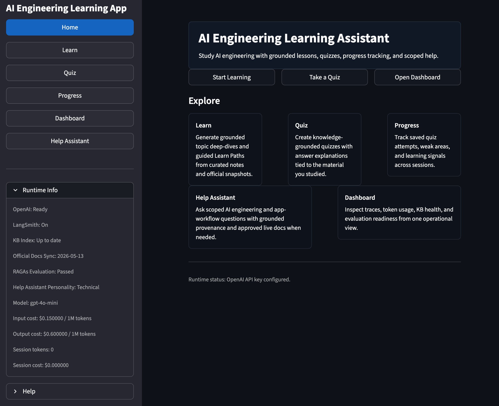

The app includes:
- Learn page with adaptive AI-generated study guides
- Quiz page with agent-generated evaluations
- Progress tracking and persistent learning memory
- Dashboard with workflow traces and RAG evaluation visibility
- Interactive Help Assistant
- Agentic RAG with official-document enrichment

---

# Problem Definition

Learning AI Engineering concepts through static tutorials and disconnected quizzes makes it difficult to:
- personalize study material
- identify weak areas
- track long-term progress
- adapt explanations to user performance
- evaluate whether retrieval systems are functioning correctly

This project solves that problem by creating an AI learning assistant capable of:
- generating adaptive learning paths
- evaluating user understanding through AI-generated quizzes
- persisting long-term learning memory
- surfacing weak areas and suggested study topics
- enriching responses with external technical documentation
- exposing workflow transparency for debugging and evaluation

The target users are:
- beginner and intermediate AI Engineering students
- developers learning LangChain/LangGraph concepts
- users exploring AI agents and RAG systems

---

# Core Technologies

- Python 3.11+
- Streamlit
- LangChain
- LangGraph
- OpenAI API
- ChromaDB
- Pydantic
- Loguru
- LangSmith
- RAGAs
- pytest

## Architecture Style

The application follows a hybrid agent architecture combining:
- deterministic orchestration
- LangGraph stateful workflows
- LLM-based generation
- persistent memory systems
- retrieval-augmented generation
- evaluation and observability pipelines

This allows the system to remain:
- inspectable
- reproducible
- adaptive
- reviewer-friendly

---

# Project Structure

```text
.
├── app.py                                  # Streamlit application entry point
├── requirements.txt                        # Python dependencies
├── .env.example                            # Example environment configuration
├── scripts/                                # Helper scripts and utilities
├── data/
│   ├── chroma_db/                          # Persistent Chroma vector database
│   ├── official_docs/                      # External documentation sources
│   ├── ragas_eval/                         # RAGAs evaluation datasets and outputs
│   └── raw/                                # Local learning documents and markdown knowledge base
├── src/
│   ├── config.py                           # Environment-backed configuration
│   ├── logging_config.py                   # Loguru logging configuration
│   ├── schemas.py                          # Shared Pydantic schemas
│   ├── graphs/
│   │   ├── learn_graph.py                  # LangGraph workflow for Learn mode
│   │   ├── learn_nodes.py                  # Learn workflow nodes
│   │   ├── learn_prompts.py                # Learn prompts and instructions
│   │   ├── learn_state.py                  # Learn workflow state
│   │   ├── quiz_graph.py                   # LangGraph workflow for Quiz mode
│   │   ├── quiz_nodes.py                   # Quiz generation/evaluation nodes
│   │   ├── quiz_prompts.py                 # Quiz prompts and evaluation prompts
│   │   └── quiz_state.py                   # Quiz workflow state
│   ├── kb/
│   │   ├── ingestion.py                    # Knowledge-base ingestion pipeline
│   │   ├── chunker.py                      # Chunking utilities
│   │   ├── embeddings.py                   # OpenAI embeddings setup
│   │   ├── retrieval.py                    # Agentic retrieval pipeline
│   │   ├── vector_store.py                 # ChromaDB integration
│   │   ├── official_docs.py                # Official documentation retrieval
│   │   └── index_health.py                 # Index health and freshness checks
│   ├── memory/
│   │   ├── db.py                           # SQLite persistence layer
│   │   ├── memory_service.py               # Long-term learning memory
│   │   └── feedback_service.py             # Feedback persistence and analytics
│   ├── services/
│   │   ├── cache.py                        # Response and workflow caching
│   │   ├── cost_tracker.py                 # Token and cost tracking
│   │   ├── retry.py                        # Retry and resilience logic
│   │   ├── observability.py                # LangSmith observability helpers
│   │   ├── external_docs_updater.py        # External documentation enrichment
│   │   └── help_assistant.py               # Interactive help assistant service
│   ├── eval/
│   │   ├── rag_evaluation.py               # Custom RAG evaluation workflow
│   │   ├── ragas_evaluation.py             # RAGAs evaluation integration
│   │   └── retrieval_validation.py         # Retrieval validation utilities
│   ├── tools/                              # Tool-calling utilities and helpers
│   ├── ui/
│   │   ├── learn_page.py                   # Learn page UI
│   │   ├── quiz_page.py                    # Quiz page UI
│   │   ├── progress_page.py                # Progress tracking UI
│   │   ├── dashboard_page.py               # Analytics and workflow dashboard
│   │   ├── help_page.py                    # Help assistant UI
│   │   ├── display_helpers.py              # Shared UI rendering helpers
│   │   └── shared.py                       # Shared Streamlit UI utilities
│   └── demo/
│       └── review_examples.py              # Demo/review helper examples
└── tests/
    ├── test_learn_graph.py                 # Learn workflow tests
    ├── test_quiz_graph.py                  # Quiz workflow tests
    ├── test_memory_service.py              # Memory persistence tests
    ├── test_dashboard_ragas.py             # Dashboard/RAGAs tests
    ├── test_retrieval.py                   # Retrieval pipeline tests
    └── test_*.py                           # Additional focused pytest suites
```

---

# Setup

## Prerequisites

- Python 3.11+
- OpenAI API key

## Installation

```bash
python -m venv .venv
source .venv/bin/activate
pip install -r requirements.txt
```

## Environment Variables

Create a `.env` file based on `.env.example`.

Example:

```bash
OPENAI_API_KEY=your_api_key_here
```

Optional settings include:
- embedding model
- Chroma persistence directory
- LangSmith configuration
- OpenAI model selection
- caching configuration

---

# Run the Application

```bash
streamlit run app.py
```

The app automatically initializes:
- LangGraph workflows
- Chroma vector store
- SQLite memory
- evaluation systems
- dashboard services

---

# Run Tests

```bash
pytest
```

Latest project state:
- 738 passing tests

---

## LangGraph Agent Workflows

The application is built around multiple LangGraph workflows that coordinate retrieval, memory loading, evaluation, validation, and adaptive generation.

### Learn Agentic RAG Graph

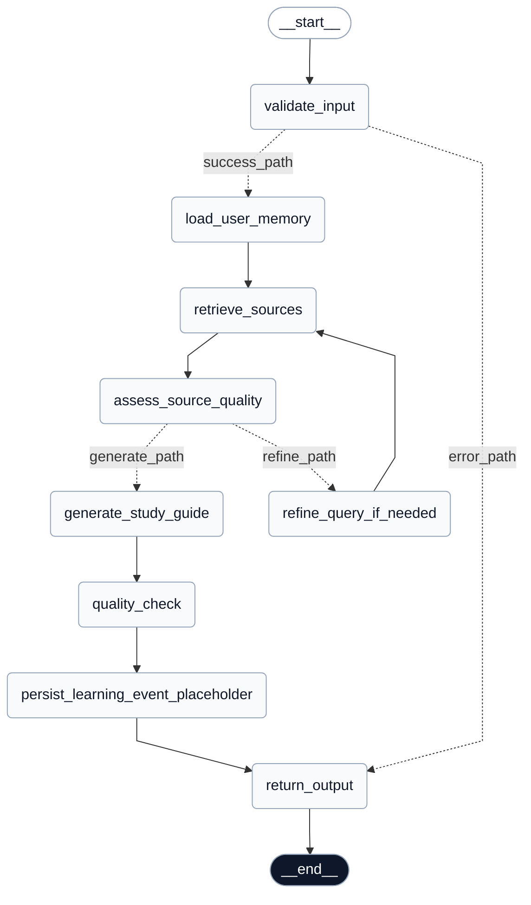

### Quiz Generation Graph

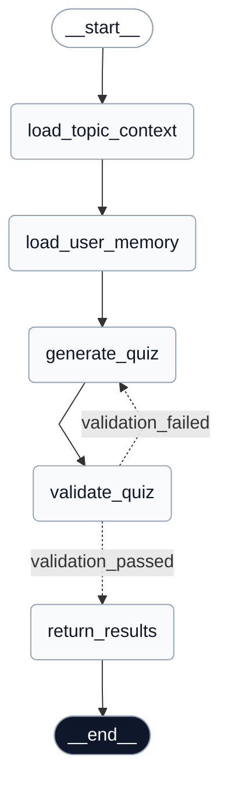

### Quiz Evaluation Graph

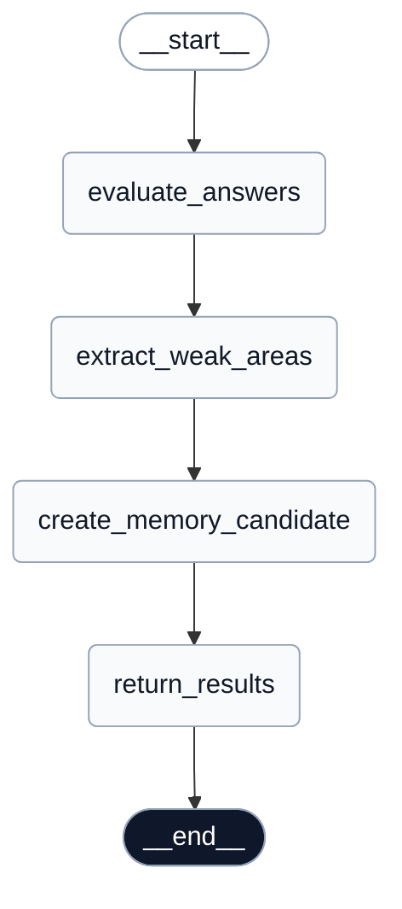

These workflows demonstrate:

- Agentic RAG retrieval loops
- Memory-aware generation
- Adaptive prompt conditioning from user feedback
- Quality validation stages
- Conditional routing and refinement paths
- Persistent learning signals and workflow observability

## Architecture Overview

The system is organized around multiple LangGraph workflows.

## Learn Workflow

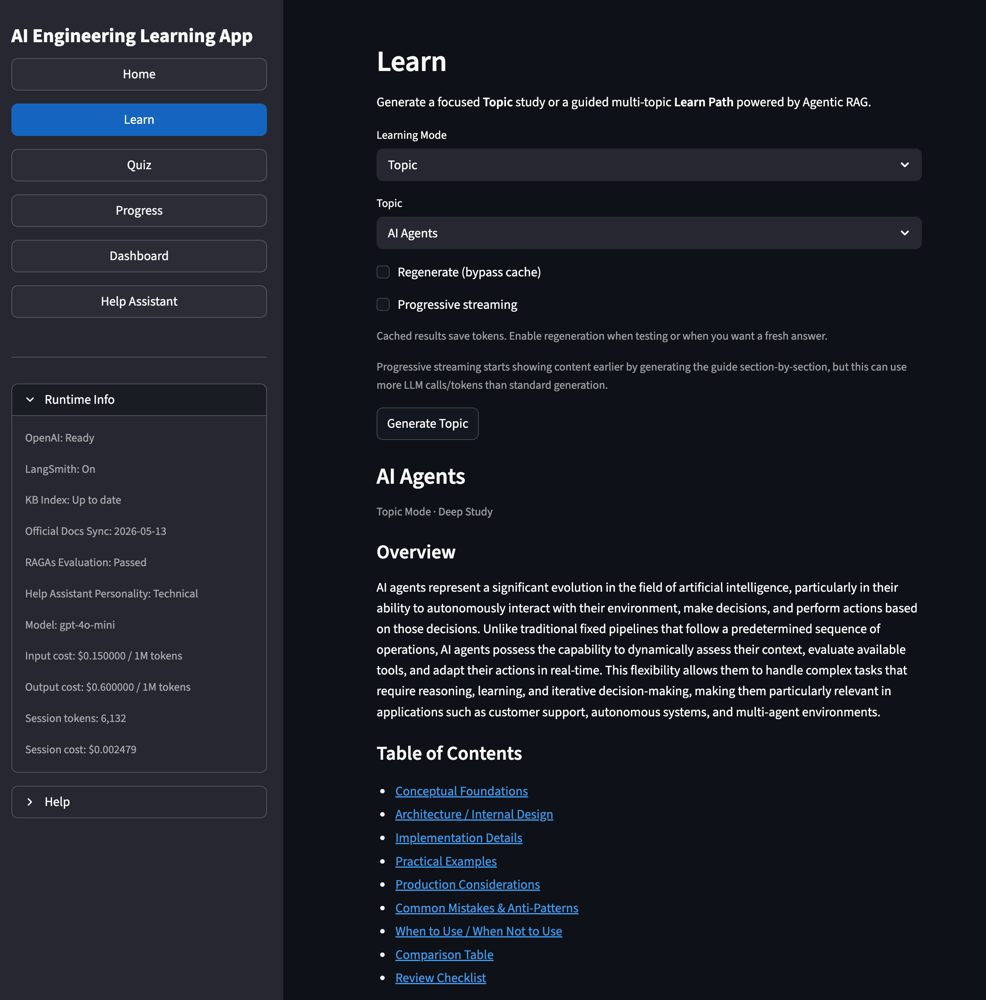

The Learn workflow:
- retrieves contextual knowledge through RAG
- generates adaptive learning material
- persists long-term study progress
- stores completed learning sessions
- enriches responses with external documentation

Workflow stages:
1. topic/context loading
2. retrieval and RAG enrichment
3. learning content generation
4. memory persistence
5. workflow trace rendering

## Quiz Workflow

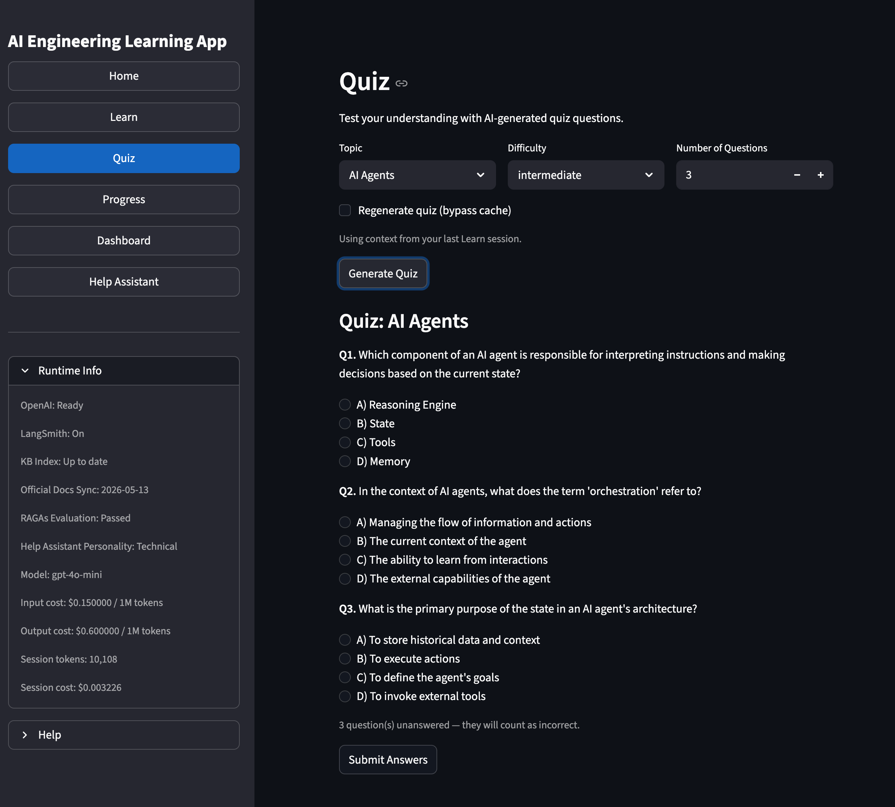

The Quiz workflow:
- generates AI quizzes dynamically
- evaluates user answers
- extracts weak areas
- suggests future study topics
- stores learning signals in memory

Workflow stages:
1. topic loading
2. memory loading
3. quiz generation
4. answer evaluation
5. weak-area extraction
6. memory persistence
7. workflow trace rendering

---

# Features

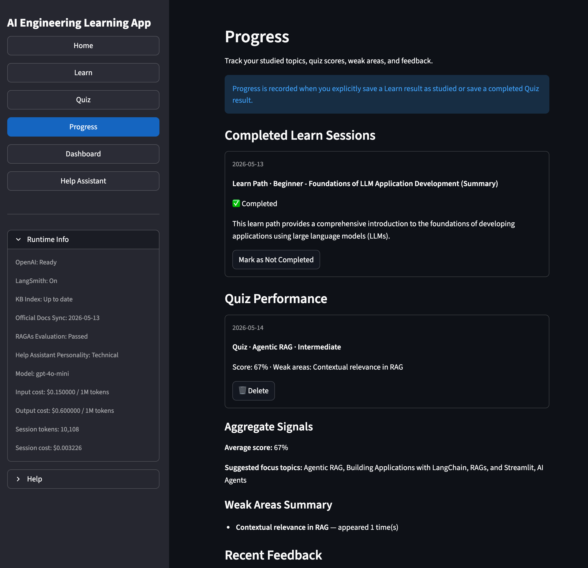

The feature set is organized to mirror the official Sprint 3 task requirements: core requirements, optional tasks by difficulty, and additional engineering improvements implemented beyond the rubric.

## Core Requirements

| Official Requirement | Implementation |
|---|---|
| Agent Purpose | AI Engineering Learning Assistant focused on guided Learn → Quiz → Feedback → Memory workflows. |
| Clear problem definition | Solves fragmented AI Engineering learning by combining study guides, quizzes, feedback, memory, and progress tracking. |
| Target users | AI Engineering students and developers learning agents, LangGraph, RAG, memory, tool calling, and evaluation workflows. |
| Core functionality | Multi-page learning app with Learn, Quiz, Progress, Dashboard, and Help Assistant pages. |
| Main agent workflow | LangGraph-based Learn and Quiz workflows with state management, memory loading, retrieval, generation, validation, and evaluation. |
| User interactions | Topic selection, learning-depth selection, quiz answering, feedback submission, memory saving, cache bypassing, progress deletion, and dashboard inspection. |
| User interface | Streamlit UI with learner-facing Progress page and technical Dashboard page. |
| Technical implementation | LangGraph, LangChain, OpenAI, ChromaDB, SQLite, Pydantic, Loguru, RAGAs, LangSmith support, and pytest. |
| Error handling | Validation, fallbacks, retry helpers, cache guards, defensive UI rendering, and safe persistence operations. |
| Documentation | Setup instructions, architecture explanation, workflow diagrams, project structure, feature mapping, and example user flows. |
| Examples of common use cases | Learn flow, Quiz flow, feedback loop, progress tracking, dashboard inspection, and Help Assistant usage. |
| Technical decisions explained | README explains why LangGraph, Agentic RAG, SQLite memory, Streamlit, ChromaDB, and evaluation tooling were used. |

## Optional Tasks — Easy

| Official Optional Task | Implementation |
|---|---|
| Ask ChatGPT to critique usability, security, and prompt engineering | AI-assisted review was used throughout development to improve usability, prompt structure, memory UX, dashboard clarity, security assumptions, and reviewer-facing transparency. |
| Give the agent a personality | Help Assistant supports multiple response styles/personalities and configurable assistant behavior. |
| Add OpenAI settings controls | Help Assistant exposes configurable generation settings, including preset styles and custom parameter controls. |
| Add an interactive help feature or chatbot guide | Dedicated Help Assistant page provides in-app guidance, AI Engineering explanations, and workflow support. |

## Optional Tasks — Medium

| Official Optional Task | Implementation |
|---|---|
| Calculate and display token usage and costs | Dashboard tracks token usage, session cost, and model/runtime usage signals. |
| Add retry logic for agents | Retry-safe service helpers and defensive workflow paths reduce transient LLM/API failure risk. |
| Implement long-term or short-term memory | SQLite-backed long-term memory stores completed Learn sessions, quiz performance, weak areas, feedback, and learning signals. |
| Implement one more function tool that calls an external API | External documentation updater and live official documentation enrichment connect the app to trusted external technical sources. |
| Add user personalization | Memory and feedback signals influence future Learn and Quiz generations at the workflow/prompt level. |
| Implement a caching mechanism | Learn and Quiz workflows use persistent cache behavior, with explicit cache-bypass controls for fresh generation. |
| Implement a feedback loop | Feedback ratings/comments are persisted, summarized into learning signals, and injected into future generation prompts. |
| Implement extra function tools and UI controls | Multiple configurable agent capabilities are exposed through the UI, including Help Assistant personalities, custom OpenAI parameters, Learn cache bypass, Quiz cache bypass, memory save/delete controls, feedback controls, and external-document update controls. |

## Optional Tasks — Hard

| Official Optional Task | Implementation |
|---|---|
| Agentic RAG | Learn workflow implements Agentic RAG with retrieval, source-quality assessment, conditional query refinement, generation, quality checks, and source-aware output. |
| Add LLM observability tooling | LangSmith support, internal workflow traces, dashboard diagnostics, and token/cost visibility provide observability. |
| Create an agent that learns from user feedback | Feedback is persisted, summarized into `simplify` / `increase_difficulty` learning signals, and used to condition future Learn and Quiz generations when fresh generation runs. |
| Integrate external data sources | Official documentation snapshots, external docs updater, live official-doc enrichment, and Chroma indexing extend the local knowledge base. |

## Extra Features Beyond the Official Rubric

| Extra Feature | Implementation |
|---|---|
| RAGAs evaluation | RAGAs evaluation workflow, saved report, tests, and Dashboard visibility for retrieval-quality validation. |
| Custom RAG evaluation | Additional retrieval validation and custom RAG evaluation utilities under `src/eval/`. |
| Live official documentation enrichment | Help Assistant and documentation pipelines can use approved official sources for fresher technical grounding. |
| External Docs / API Updater | Dashboard-accessible updater refreshes official documentation snapshots used by retrieval. |
| Help Assistant page | Dedicated assistant for project guidance, AI Engineering explanations, workflow help, source provenance, personalities, and runtime controls. |
| Agentic workflow diagrams | Mermaid diagrams for Learn, Quiz Generation, and Quiz Evaluation workflows document the LangGraph structure. |
| Workflow trace panels | Learn and Quiz expose execution traces so reviewer/users can inspect graph behavior. |
| Raw trace/debug visibility | Dashboard and result panels show raw workflow trace information for debugging and review. |
| Memory transparency | Learn, Progress, and Dashboard expose what memory exists and how it affects personalization. |
| Learner-facing Progress page | Completed Learn sessions, Quiz Performance, Recent Feedback, and Feedback Summary are separated into user-readable sections. |
| Technical Dashboard page | Review-oriented dashboard shows workflow readiness, learning signals, cost tracking, KB health, RAGAs state, and observability state. |
| Weak-area extraction | Quiz evaluation extracts concise weak-area labels instead of repeating full missed questions. |
| Suggested study topics | Quiz weak areas are mapped to relevant Learn topics and paths. |
| Answer review UX | Quiz review shows correct/incorrect answer cues with Streamlit success/error states. |
| Quiz cache bypass | User can force fresh quiz generation to avoid stale cached questions. |
| Learn cache bypass | User can regenerate Learn content instead of using cached output. |
| Persistent completed-session controls | Learn sessions can be marked as studied and removed from Progress for debugging/review. |
| Persistent feedback controls | Feedback is stored, displayed, summarized, and deletable from Progress. |
| Quiz performance cleanup | Quiz performance records can be deleted through guarded Progress controls. |
| Source-aware study guides | Learn output exposes sources and grounding information from retrieved documents. |
| Knowledge-base health dashboard | Dashboard shows Chroma/index status and rebuild/readiness information. |
| Official docs Chroma collection | Official documentation snapshots are indexed separately from curated local learning material. |
| Token and cost accounting | Cost tracking is displayed in Dashboard and updated when fresh LLM calls run. |
| LangSmith configuration support | Observability settings can enable external tracing when credentials are provided. |
| Structured schemas | Pydantic models are used for typed workflow outputs, settings, and validation boundaries. |
| Structured logging | Loguru-based logging supports debugging and operational visibility. |
| Extensive regression tests | The project includes a large pytest suite covering graphs, memory, UI helpers, RAG, RAGAs, official docs, dashboard behavior, caching, and feedback. |
| Reviewer-friendly demo design | The app separates learner-facing UX from technical observability to make review walkthroughs easier. |

# Evaluation and Observability

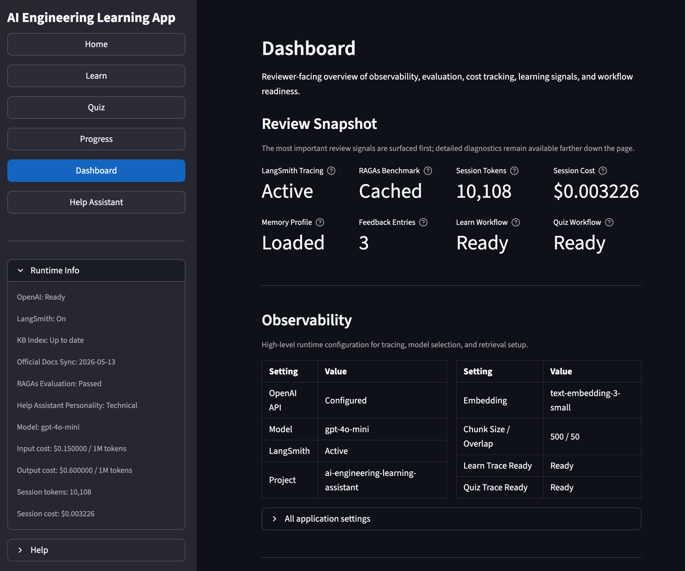

## LangSmith Integration

The project includes LangSmith observability for:
- workflow tracing
- runtime visibility
- debugging support
- agent execution inspection

## RAGAs Evaluation

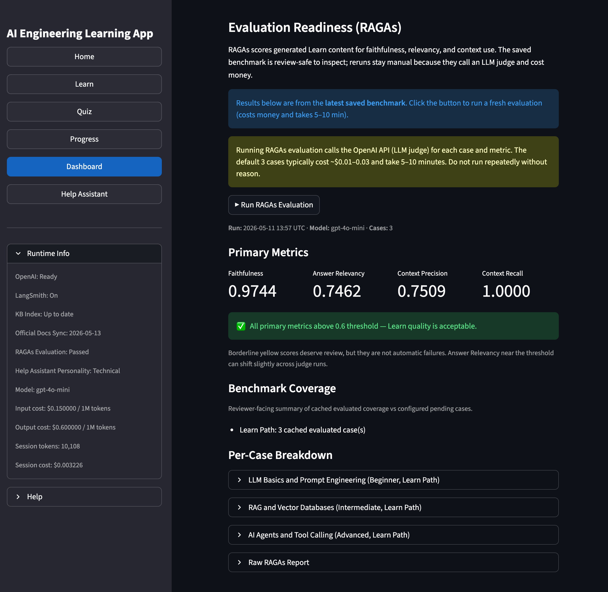

The app includes RAGAs-based evaluation utilities for:
- retrieval relevance
- retrieval precision
- answer faithfulness
- contextual grounding

## Dashboard Evaluation Visibility

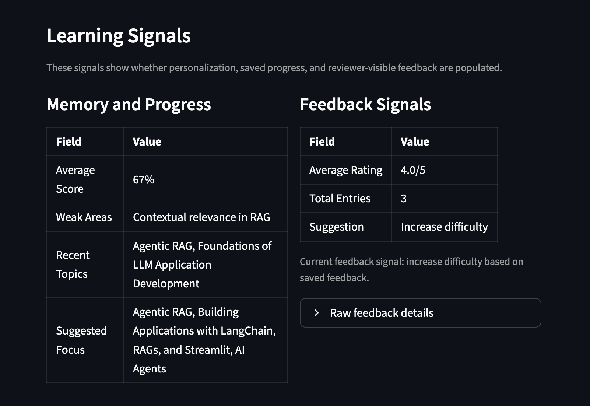

The dashboard surfaces:
- workflow readiness
- learning signals
- evaluation summaries
- reviewer-visible traces
- retrieval transparency

---

# Security and Reliability

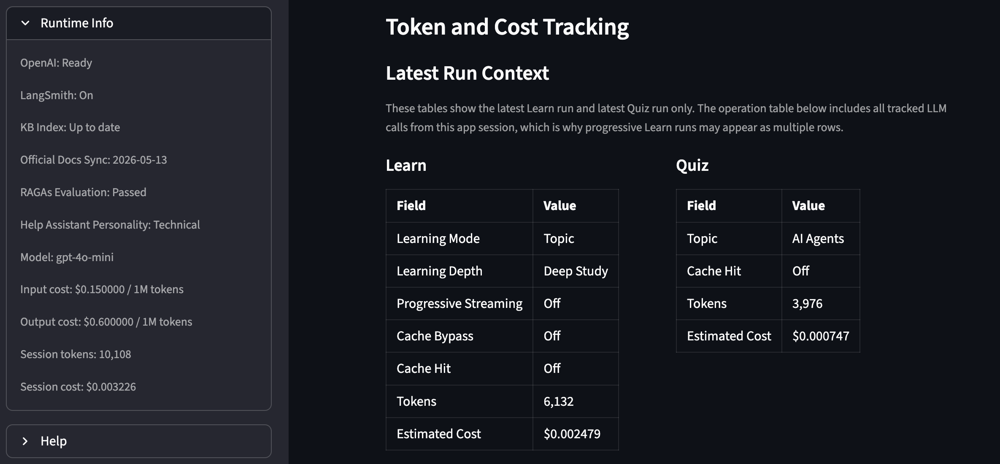

The project includes:
- environment-based API key management
- structured error handling
- retry logic
- defensive workflow validation
- safe fallback behavior
- persistent memory isolation
- cache bypass support for debugging

---

# Example Workflow

## Learn Flow

1. User selects a learning topic.
2. LangGraph Learn workflow starts.
3. Relevant knowledge is retrieved through RAG.
4. AI generates contextual study material.
5. Progress is persisted into long-term memory.
6. Dashboard updates learning signals.

## Quiz Flow

1. User generates a quiz.
2. LangGraph Quiz workflow creates questions.
3. User submits answers.
4. AI evaluates results.
5. Weak areas are extracted.
6. Suggested study topics are generated.
7. Results are stored in learning memory.
8. Dashboard updates personalization signals.

---

# Reflection and Future Improvements

Potential future improvements include:
- multi-user authentication
- cloud deployment
- collaborative multi-agent workflows
- advanced personalization strategies
- voice interaction
- real-time adaptive curriculum generation
- stronger retrieval benchmarking
- local LLM support
- agent-to-agent collaboration

---

# Why LangGraph Was Used

LangGraph was chosen because the project required:
- stateful workflows
- branching execution paths
- persistent memory integration
- workflow transparency
- inspectable agent execution
- deterministic orchestration

Compared to a simple chain-based architecture, LangGraph made it possible to:
- separate Learn and Quiz workflows
- expose reviewer-visible execution traces
- persist memory across workflows
- support adaptive learning flows

---

# Key Learning Outcomes

This project demonstrates:
- understanding of AI agent architectures
- practical LangGraph workflow orchestration
- implementation of Agentic RAG systems
- long-term memory integration
- observability and evaluation workflows
- structured software engineering practices
- production-style project organization

---

# Final Notes

This project intentionally combines:
- AI agents
- retrieval systems
- evaluation workflows
- memory systems
- observability
- educational UX

into a single integrated learning platform.

The goal was not only to build a functional educational assistant, but also to demonstrate:
- agent orchestration
- workflow transparency
- persistent memory handling
- retrieval evaluation
- scalable project organization

in a production-style AI Engineering application.

